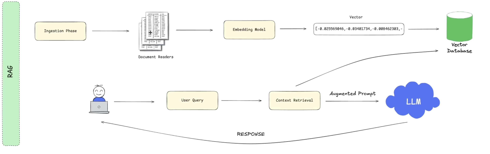

# Spring AI RAG Application
This project is a Retrieval Augmented Generation (RAG) application built with Spring AI, leveraging LLMs via either local Ollama or Mistral API.




## Setup Instructions
### 1. Start Infrastructure with Docker Compose

This project includes a Docker Compose configuration that sets up both PostgreSQL and Ollama LLM:

``` bash
docker-compose up -d
```
This will start:
- PostgreSQL database with pgvector extension (ankane/pgvector:v0.5.0) on port 5432
  - pgvector is a PostgreSQL extension that enables vector similarity search capabilities, which is essential for storing and querying embeddings in our RAG application
- Ollama service on port 11431

### 2. Initialize the Database

> ⚠️ **Important**: Tables should be created automatically when PostgreSQL container starts,
> as scripts in the `postgres/scripts` directory are mounted to `/docker-entrypoint-initdb.d` which executes
> them on container initialization.
> If tables weren't created automatically (which might happen if the PostgreSQL data volume was already initialized), 
> you can manually run script that you can find here: `./postgres/scripts/01-create-tables.sql `


### 3. LLM Setup
#### Using Ollama (Default)
When using Docker Compose, two models will be automatically pulled:
- `gemma3:4b-it-q4_K_M` (for chat functionality)
- `mxbai-embed-large` (for embeddings)

This process happens in the background and may take several minutes depending on your internet connection.
To verify the models are properly installed, you can check:
``` bash
curl http://localhost:11431/api/tags
```
This should return a JSON response listing both models. The application is ready to use once both models appear in the response.
#### Using Mistral API (Alternative)
If you prefer not to run Ollama locally:
1. Obtain a free API key from [Mistral AI](https://mistral.ai/)
2. Set the API key as an environment variable:
``` bash
   export MISTRAL_API_KEY=your-api-key-here
```
1. Run the application with the `mistral` profile (see below)

## Running the Application

1. Run with default (Ollama) profile:
``` bash
   mvn spring-boot:run
```
Or with Mistral profile:
``` bash
   mvn spring-boot:run -Dspring-boot.run.profiles=mistral
```
## Architecture
This application implements a Retrieval Augmented Generation (RAG) pattern that enhances LLM responses with relevant information from a vector database.

The database schema uses pgvector to store and query vector embeddings efficiently:


- **chat**: Stores chat id, creation timestamp, and title
- **chat_entry**: Stores individual messages in a chat with content, timestamp, and role (USER/ASSISTANT)
- **vector_store**: Stores vector embeddings of RAG documents for similarity search
- **loaded_document**: Stores info about RAG documents loaded into the vector_store during application startup to prevent processing and loading them multiple times
## Troubleshooting
- If using Docker Compose, ensure all services are running: `docker-compose ps`
- For Ollama, verify models are downloaded by checking: `curl http://localhost:11431/api/tags`
- For Mistral API, verify your API key is correct and properly set
- Check that database tables were properly created with the initialization script and are correctly populated with RAG data after application startup

